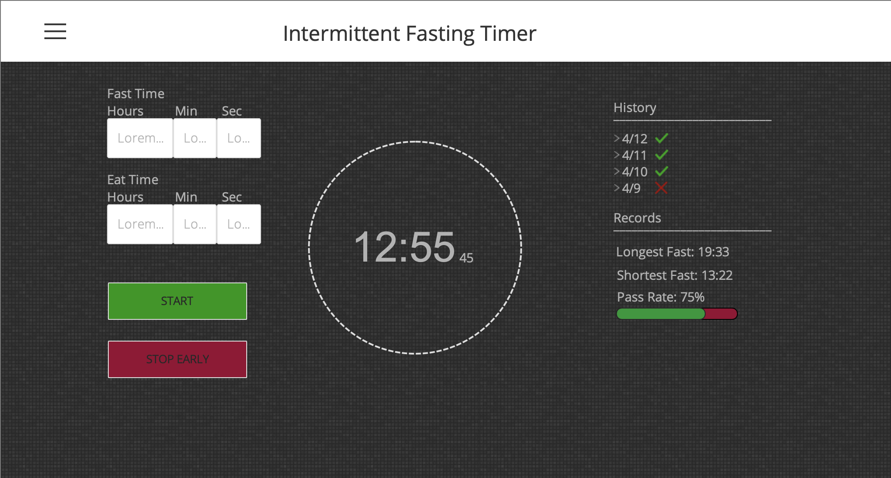

<!-----
NEW: Your output is on the clipboard!

NEW: Check the "Suppress top comment" option to remove this info from the output.

Conversion time: 2.434 seconds.

Using this Markdown file:

1. Paste this output into your source file.
2. See the notes and action items below regarding this conversion run.
3. Check the rendered output (headings, lists, code blocks, tables) for proper
   formatting and use a linkchecker before you publish this page.

Conversion notes:

* Docs to Markdown version 1.0β24
* Mon May 18 2020 11:59:28 GMT-0700 (PDT)
* Source doc: Intermittant Fasting Timer
* Tables are currently converted to HTML tables.
* This document has images: check for >>>>>  gd2md-html alert:  inline image link in generated source and store images to your server.

WARNING:
You have 13 H1 headings. You may want to use the "H1 -> H2" option to demote all headings by one level.

----->

<!-- 
 -->

# Intermittent Fasting Timer

## Check out the live app here!
https://intermittent-fasting-tracker.netlify.app/

## Project Proposal

Convenient timer to track fasting progress

                        May 18th, 2020

                        Prepared by

                        Coleman Jenkins, Annie Cao, Alan Li

                        Prepared for

                        Annie Sharkey, Camille Cooper

## Team Introduction

**Coleman Jenkins **As someone who has always loved music and engaged problem solving, Coleman loves to spend time at the intersection of music and technology. He enjoys using music software and doing live sound production which inspires him and pushes him to improve. 

In order to pursue these desires further in the future, Coleman is planning to major in Computer Engineering and Computer Science. He is also a member of UVA Solar Car which builds a street-legal car powered completely by solar panels. This helps him see how software and hardware interact and enables him to create systems that work to accomplish a goal. In his free time, Coleman drums with Chi Alpha Christian Fellowship and plays and other musical instruments to relax and refocus.

**Alan Li **Having lived in over ten states and outside of the US, Alan has nothing holding him back from pursuing new opportunities in new and unknown subjects. Living among so many diverse backgrounds has inspired him to optimize society’s tools for succeeding through his passion for software engineering and economics. By meshing these two fields together he hopes to develop new ideas to improve the efficiency at which problems can be solved. Within the environment of the company, he hopes to create a relationship that promotes growth on both sides. Alan is an anticipated Computer Science Major at UVA and hopes to develop a deeper understanding of its relationship with non-technological fields to better serve the diverse needs of today’s society.

**Annie Cao **Annie has been fascinated with human health and biology, particularly in a medical context, since she was a child. When she discovered an equivalent passion for statistical data and computer science in her first year at college, she delved into the intersection between these fields. Annie is majoring in Computer Science and taking courses in statistics and biology as well. Annie also has a knack for managerial and administrative duties. During her internship at the medical technology company ResMed last summer, Annie drafted technical documentation, investigated new software for the department, and co-piloted an early testers program for other project managers. Ultimately, she is looking forward to honing and applying her interdisciplinary skills and knowledge this summer during Launch. Outside of classes, she volunteers at the Emily Couric Clinical Cancer Center and enjoys drawing in her free time.

Table of Contents

## Introduction

Intermittent fasting is a health technique individuals may use to manage how they’re consuming food, leading to both mental and physical benefits. During intermittent fasting, individuals set aside an amount of time each day where they cannot eat. The purpose of the Intermittent Fasting Timer is to allow individuals to easily keep track of their fasts, both current and in the past. 

To keep track of a new fast, users must first set up the timer by selecting an option from the menu of common fasts (i.e., 16:8, 18:6) built into the application, or developing a custom fast. The time for the fasting period is then entered into a circular timer, and the time will count down towards 0:00:00. Adjacent to the circular timer is an icon showing the type of fast and two buttons allowing the user to start and stop the timer. If the user stops the timer before the timer has reached 0:00:00, the user has failed the fast; if the timer successfully reaches 0:00:00, the user has succeeded in the fast.

To keep track of past fasts, users may refer to their history, where a list of each fast they have previously done through the application can be found. Each item in the list shows the type of fast, the length of the fasting period, time/date information about the fast, and the result of the fast (pass vs. fail). Users may also refer to their Records section, where they can find the length of their longest and shortest fasting periods and the percentage of fasts that they have passed. Also adjacent to a timer is an icon showing the number of hours since the last fast the user has completed (regardless of whether the fast was successful or not).

## Key definitions

<table>
  <tr>
   <td>Client
   </td>
   <td>HackCville Launch
   </td>
  </tr>
  <tr>
   <td>User
   </td>
   <td>The person using the web app for fasting
   </td>
  </tr>
  <tr>
   <td>Web Application
   </td>
   <td>Timer web application
   </td>
  </tr>
  <tr>
   <td>Developer
   </td>
   <td>Launch-SWE-1
   </td>
  </tr>
  <tr>
   <td>Fasting
   </td>
   <td>Abstain from consuming food
   </td>
  </tr>
  <tr>
   <td>Successful Fast
   </td>
   <td>A fasting period in which the timer reaches 0:00:00.
   </td>
  </tr>
  <tr>
   <td>Failed Fast
   </td>
   <td>A fasting period in which the user stops the timer before it reaches 0:00:00.
   </td>
  </tr>
</table>

## Technologies to be implemented

The project will require the use of the following technologies:

React.js - React is a Javascript library created by Facebook that efficiently builds user interfaces

Git and Github - Github is a software development platform that allows for source control as developers share and work on code.

## Project requirements

### Fasting Timer

The user will be able to select the length of time they would like to fast. For example, if they are doing a 16:8 fast, the fast length they would choose would be 16 hours. This can be of a specific (typical) length, like 16 hours or 18 hours, but may also be customized to any length (specifically to the seconds level). 

The fasting timer will show a clock with the amount of time left in the fast: it will display hours, minutes, and seconds remaining. The user will be able to start the timer manually. 

Once the timer has been stopped or once the timer reaches 0:00:00, the fast is marked as complete, and the user will be able to see past fasts in a “History” section and the timer will be reset to the previously allotted time and ready to be started again.

The numbers on the timer will be green as long as the timer is counting down and will remain green if the timer reaches 0:00:00. The numbers will turn red if the user stops the timer before it reaches 0:00:00. Once the timer reaches 0:00:00 it will be reset to the length of fasting, for example, 16:00:00.

### Timer Controls

The user can interact with the timer via the timer controls. These include one icon showing the type of fast (e.g., 16:8 vs. custom 5:5) and two buttons: start and stop. The start button allows the user to manually start the timer once the time has been set (as determined by selecting a template fast or creating a custom fast), and the stop timer allows the user to stop the timer before it hits 0:00:00, thus indicating that they have broken the fast.

### History Section

The user can see all of their previous fasts in a list. Each item in the list shows:

*   The date of the fast: only the start date is shown first, but the user may click for more information, including the exact times and dates for the start and end of the fast.
*   The length of the fast: this is determined by either the whole planned length of the fast, or from the start of the fast to whenever the user stopped the timer.
*   The result of the fast: this will show whether the user completed their fast successfully or gave up before the timer stopped.

### Records

The user can see the lengths of their longest and shortest fasts; the longest and shortest fasts are determined only from the set of fasts that the user has completed (meaning that a fast that is currently being timed is not considered), though these fasts do not have to have been completed successfully. The user can also see the percentage of all fasts that they have completed successfully out of all the fasts they have completed.

### Time Since Last Fast

The user can see the number of hours that has passed since they have completed their last fast in an icon below the timer.

### Incentivizing Messages

The user can see messages displayed near the timer that tell them positive messages and encourage them to continue the fast. The messages change automatically every hour.

### Stretch Goals

The user will experience the following within the application:

*   As the timer numbers tick down, a red progress bar encircling the timer will be filled proportionally with green as the time progresses. 
*   Confetti will rain down across the screen when a fast has been completed successfully (i.e., when the timer for a fast reaches 0:00:00).
*   Users can write notes about a specific fast and refer to these notes within the History section.
*   Fasting streaks and longest fasting streak will be recorded. Streaks are determined by having more than one successful fast in a row. Streaks will be found within the Records section.

## Project timeline

<table>
  <tr>
   <td><strong>Task</strong>
   </td>
   <td><strong>Description</strong>
   </td>
   <td><strong>Hours</strong>
   </td>
  </tr>
  <tr>
   <td>Timer
   </td>
   <td>Users can track the time until their fast ends using this display. 
   </td>
   <td>10
   </td>
  </tr>
  <tr>
   <td>Time Selection Buttons
   </td>
   <td>Users can choose their preferred time setting for fasting which will set the timer.
   </td>
   <td>5
   </td>
  </tr>
  <tr>
   <td>Display of Break Time
   </td>
   <td>The display will show the amount of time since last fast to the nearest hour.
   </td>
   <td>5
   </td>
  </tr>
  <tr>
   <td>History Log
   </td>
   <td>Shows users past fasts and whether or the user succeeded or failed the specific fast. It will also show users a more detailed start and end time with a drop-down bullet.
   </td>
   <td>5
   </td>
  </tr>
  <tr>
   <td>Records
   </td>
   <td>Users can see lengths of the longest and shortest fasts in addition to a percentage of fasts they have passed.
   </td>
   <td>5
   </td>
  </tr>
  <tr>
   <td>Incentivizing Messages
   </td>
   <td>Will show messages that will encourage the user to continue in their fast and not give up. The messages will change every hour.
   </td>
   <td>5
   </td>
  </tr>
  <tr>
   <td>Styling
   </td>
   <td>The web app should have clean and convenient functionality to ensure smooth usage.
   </td>
   <td>10
   </td>
  </tr>
</table>